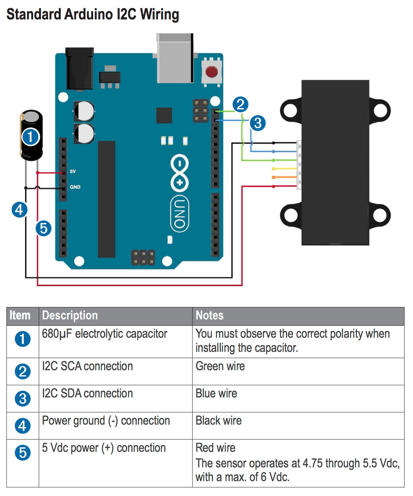

# Lidar Lite V3 Experimentation

**Author:** Tatum Alenko  
**Date:** October 11, 2018  
**Modified:** October 13, 2018  

## Purpose
In preparation for the upcoming integration of the autonomous self-driving feature of the robot, and before purchasing a new LIDAR device capable of accomplishing such task, we decided to grab hold of our current LIDAR (Garmin's Lidar Lite V3) to see what kind of software stack/plan we should envision.

## Observations
The `LIDARLite_Arduino_Library` supplied with the device (found [here](https://github.com/garmin/LIDARLite_Arduino_Library)) was a good starting point to starting to tinker around. I was able to successfully get I2C communication established using an Android UNO setup connected as detailed in the official product manual (found [here](http://static.garmin.com/pumac/LIDAR_Lite_v3_Operation_Manual_and_Technical_Specifications.pdf) and also added in the root of this demo repository). The Arduino sketch I successfully uploaded to the UNO and ran was located in `examples/v3/GetDistanceI2c/GetDistanceI2c.ino`. After loading the library into the Arduino IDE library folder (see the Github link to the source code to find out how), I was able to open up a serial terminal in the Arduino IDE and point the Lidar in various directions and see a constant feed of new integer values loaded on a new line that indicated the distance estimation in cm.

The wiring diagram is shown below (*taken from the manual*):

An image of the actual connection setup accomplished is shown below (*taken with my sick iPhone*):

As you can probably tell, a 680nF capacitor can be hard to find, so we had to connect multiple smaller capacitors in parallel to get it to the correct amount (the voltage rating is not important as long as it is at least rated for 5V+).

Some findings I've discovered so far:
* The LIDAR Lite V3 is a 1D lidar device: this implies that it cannot be used (in its basic form and on its own) as a SLAM (Simultaneous Localization and Mapping) device 
* To accomplish SLAM, we require a 2D capable Lidar device: this implies a much costlier investment